# Casos de Uso

Son los encargados de realizar la lógica del negocio.

En este caso, se crea un caso de uso que permita llamar métodos de la persistencia para guardar las tecnologías.

La persistencia será una abstracción de tal forma que no necesite saber cómo, ni dónde persiste las tecnologías, solo sabe que las persiste.

## Creemos nuestro primer test:

Primero, vamos a crear la clase del test, si presionas la combinación (alt + insert) sobre cualquier lado dentro de la clase,
aparecerá un menú desplegado en el que eligirás la opción test:

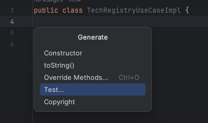   

Luego aparecerá esta ventana:

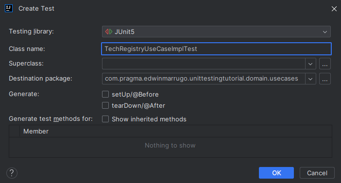

Luego, se creará la clase del test en el siguiente directorio:

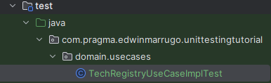   

Ahora, se crea un método con la anotación @Test indicando que será nuestro método de prueba y @DisplayName para describir en 
pocas palabras lo que debería testear el método:

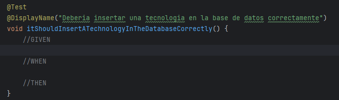  

Los comentarios GIVEN, WHEN, THEN describen el comportamiento en que organizamos nuestro test, el cuál es un patrón llamado 
BDD.

La estructura del test será la siguiente:

DADA una tecnología con:
- id = "TC0001"
- name = "Spring framework"
- description = "Framework de Java"

Y DADO que al ejecutar el método de insertar de la persistencia, cuando se pase la tecnología anterior, 
retornará el objeto guardado. (Esto es un mockeo de servicio)

CUANDO se invoque el método para guardar la tecnología.
ENTONCES, la persistencia debe devolver el objeto creado correctamente.

Dada la estructura, vamos a llevarlo al código:

Para usar mockito, se necesita agregar la extensión a la clase e indicar cuáles son los mocks y cuál es la clase a probar e inyectar los mocks
que en este caso solo es el de la persistencia:

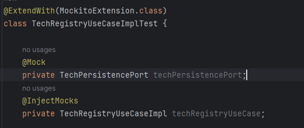

Ahora revisemos el test:

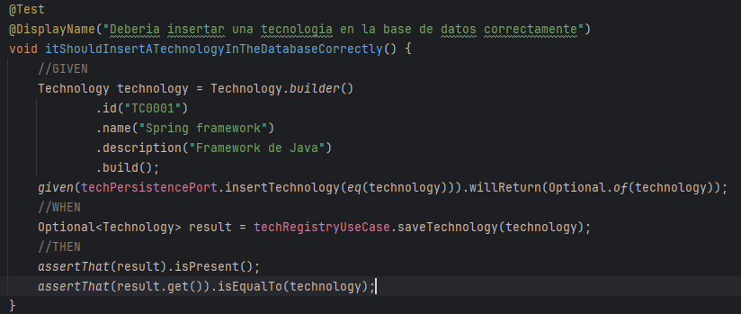

En este test, pasan muchas cosas:

Previamente, se creó el método "insertTechnology()" en la interfaz de techPersistencePort:

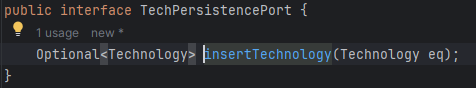  

Además de la implementación mínima del método que vamos a probar, de la calse "testTegistryUseCase", "saveTechnology()":

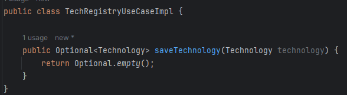

1) la instrucción *given(techPersistencePort.insertTechnology(eq(technology))).willReturn(Optional.of(technology));*

given es un método de BDDMockito que permite simular el comportamiento del método original cuando se ejectute pasándole el
objeto technology, el cuál, es pasado usando un método eq que pertenece a la librería de ArgumentMatchers, los cuales permiten 
indicarle al mock que si un objeto igual al que le dijimos pasa, ejecute el método.
Y por último el willReturn es el valor de retorno del método cuando se ejecute.

2) Luego se ejecuta la instrucción *Optional<Technology> result = techRegistryUseCase.saveTechnology(technology);* para realiazr
el llamado al método que vamos a testear.
3) Finalmente, el assertThat de la librería AssertJ, permite comprobar que el valor resultado esté presente y que sea igual al
objeto que pasamos.

Ahora, ejecutamos:

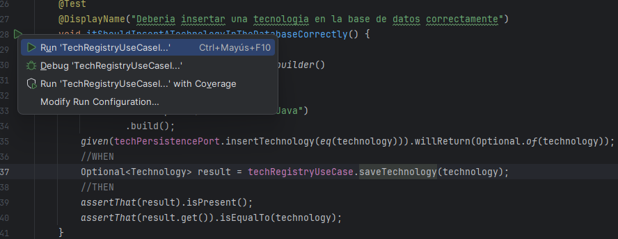  

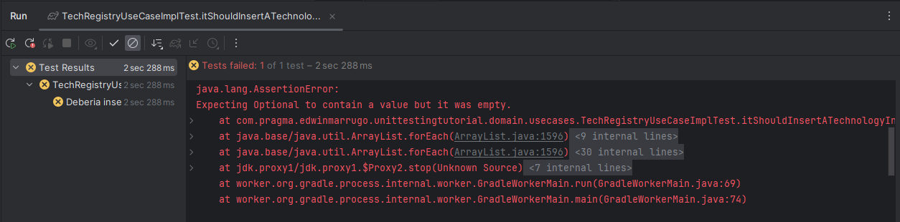

¡Oh, falló el test! Claro, porque no hemos agregado la lógica necesaria para hacer pasar el test.
Hagámoslo:

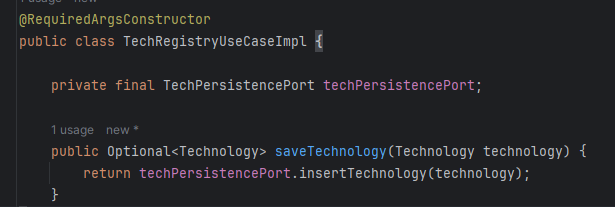  

En este caso, se añadió el puerto de persistencia, el constructor con argumentos requeridos para luego inyectar la dependencia,
y se llama el método que mockeamos (simulado) de la persitencia.

Si ejecutamos el test de nuevo, veremos que esta vez, funcionó según lo planeado:

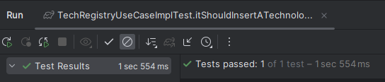  

A este proceso se le conoce como el Red green refactor. Primero se hace fallar, luego se hace pasar con la mínima solución posible y
luego si existe lugar, se refactoriza para mejorarlo:

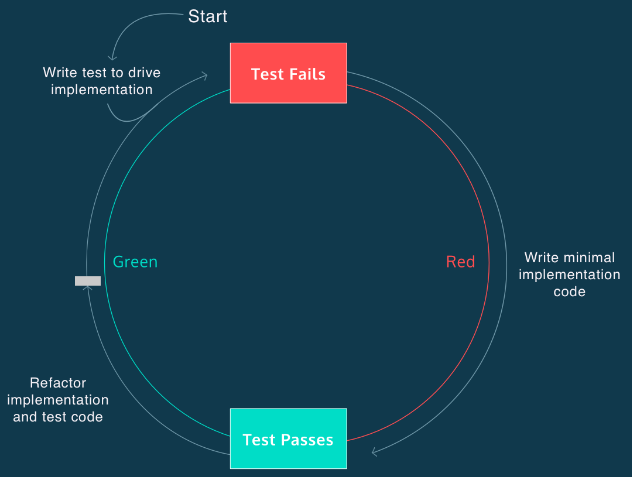  

