# ¡Escribe tu primer test!

## ¿Cuál es el contexto de negocio?

Resulta que el negocio no sabe sumar, restar, multiplicar ni dividir. Así que nos pidió que le ayudaramos con un programa
de consola que tomara 2 números como entrada y devolviera la suma, resta, multiplicación y división.

En este caso, lo que haremos será solo construir los métodos que permitirán realizar dichas operaciones.

## ¿Por dónde comenzamos?

1) Crea una clase que se llame, "Calculadora".
2) Permite que el IDE te ayude un poco. Presiona (Alt + Insert) dentro de las llaves ("{ }") de la clase "Calculator" y 
selecciona "Test..."
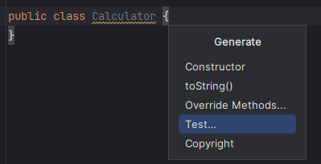
3) En la ventana que acaba de aparecer, existen opciones que veremos más adelante. Por ahora solo presionemos "OK":
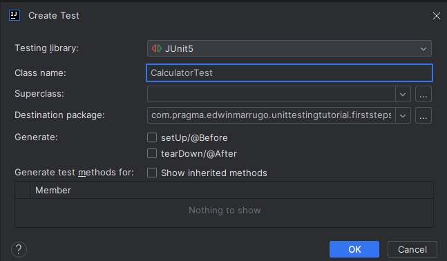

5) Notarás que se acaba de crear una clase así:   
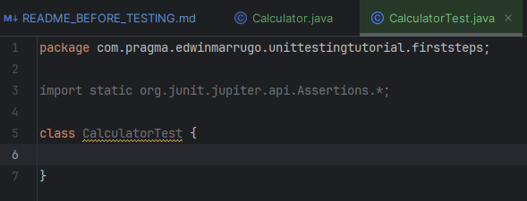

Además, notarás que se creó un paquete en el módulo de test en el que se guarda la clase para el test:   
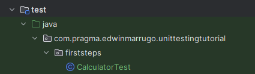   
7) Ahora, agrega un método de testeo con (Alt + Insert) otra vez y selecciona "Test Method"  
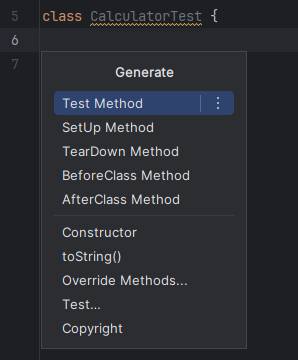
8) Escribe el nombre del test de tal forma que para cualquier otro desarrollador que lo lea, pueda al menos tener una idea
 de lo que hace. Por ejemplo, así:  
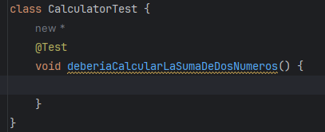   
Como ves, apareció una anotación llamada *"@Test"*, esta solo indica que el método tendrá un comportamiento de test.
9) ¡Ahora sí!  ¡A tirar código! pero antes, es importante seguir un patrón para organizar los tests y tener buenas prácticas. 
 Para este ejemplo, utilicemos el patrón GIVEN WHEN THEN de BDD (Desarrollo Orientado a Comportamiento. Este patrón lo que nos dice es que primero, dadas unas condiciones 
iniciales, cuando se ejecute la función objetivo, entonces asegurémonos de que todo salga como esperamos.

Escríbamos el test de sumar dos números usando el patrón BDD:

DADOS los números 3 y 2, CUANDO ejecute la función de sumar, ENTONCES el resultado debe ser igual a 5.

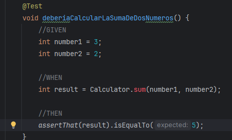   

Como no tenemos ninguna función llamada sum en nuestra clase Calculadora, el IDE dice que no existe. Por lo tanto, vamos a crearla:
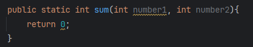
10) Si corremos el test, ¿qué pasará?    
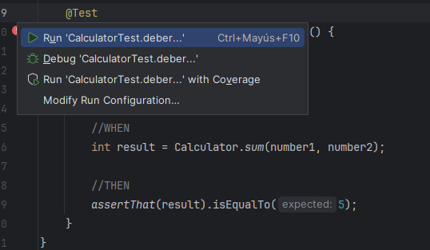  
Como ves, "sum" ya no está en rojo y está listo el test para correr, veamos el resultado:

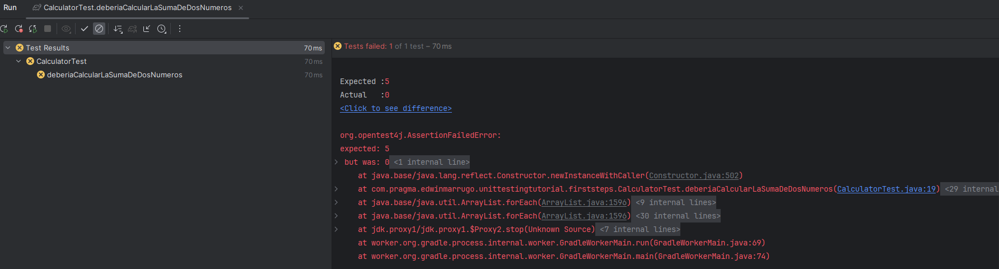

¡Falló el test!  

Claro, porque la función que construimos siempre devuelve 0 como te diste cuenta en el paso 9. Ahora vamos a hacerlo pasar escribiendo lo que debe hacer:

   

Listo, ahora corramos el test de nuevo:
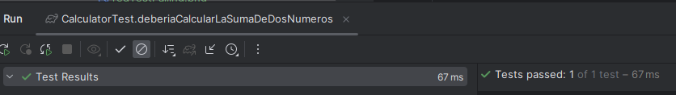   
¡Qué felicidad, nuestro test pasó!

## ¡Felicidades, escribiste tu primer test con Junit 5 usando BDD y TDD! ##