# Capa de Persistencia

Ahora vamos a desarrollar la capa de persistencia.

Primero, creamos la entidad:

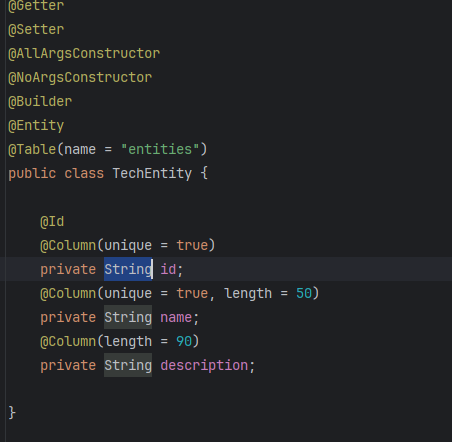 

Ahora, creamos el repositorio de JPA: 

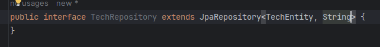  

Configuramos la base de datos:

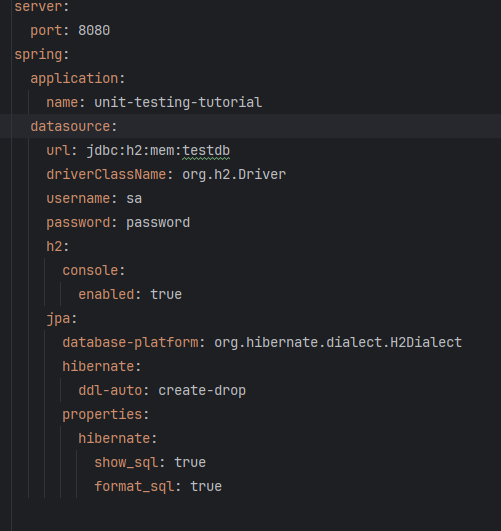  

Creamos una clase de configuración: 

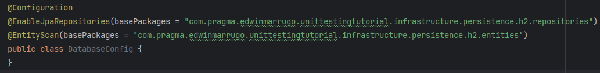  

Y ahora sí, a desarrollar la lógica de la persistencia que para este caso, iré más rápido:

Extendemos del puerto que expusimos en el dominio y retornamos algo para empezar:

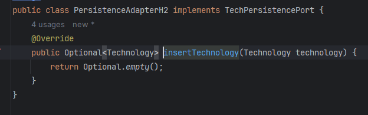

Ahora creamos el test que sabemos fallará:

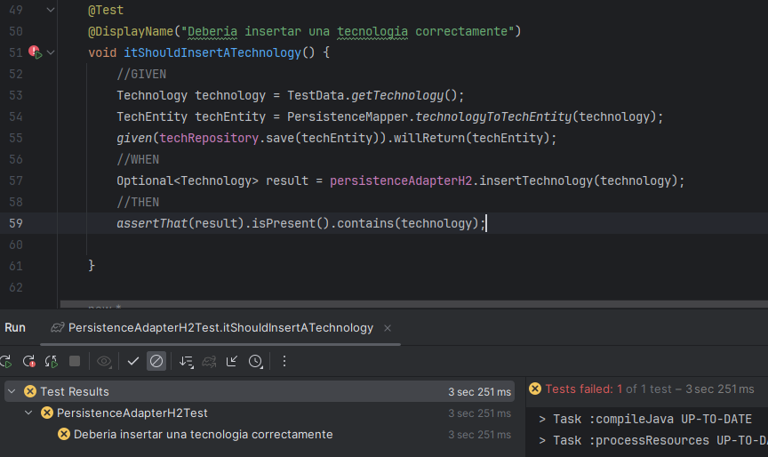  

Y ahora lo hacemos pasar:

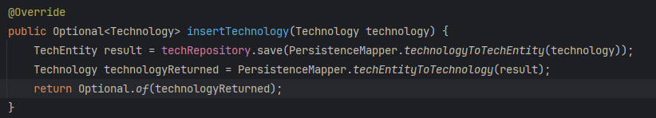

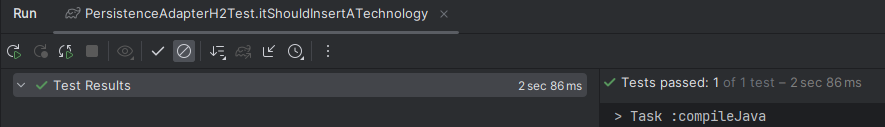

Hagamos los demás tests:

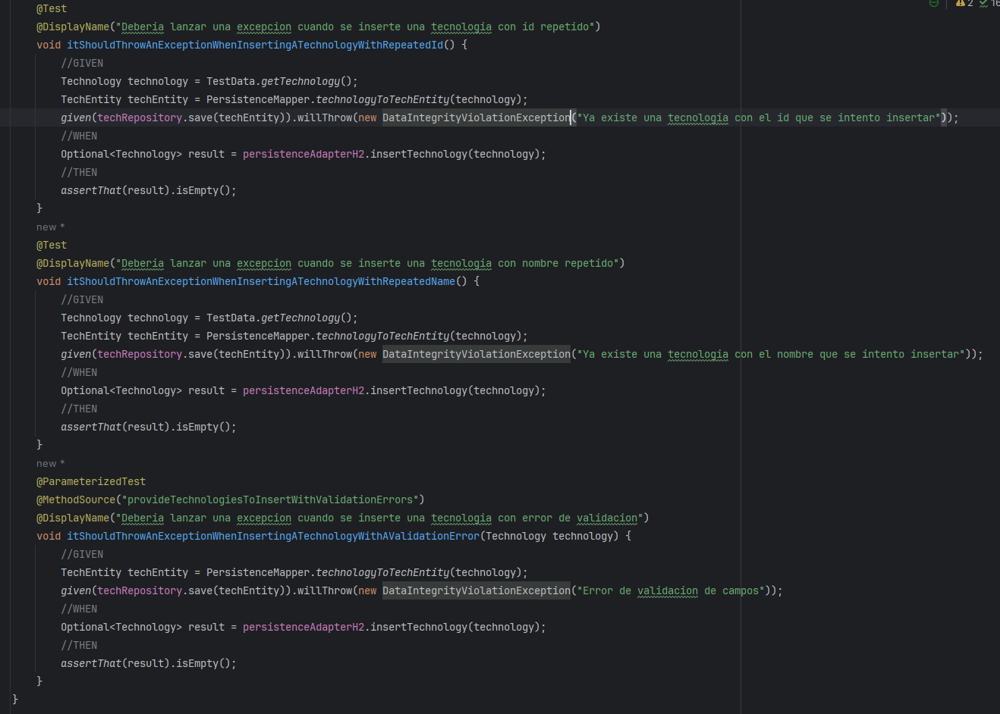

Es claro que van a fallar, por lo tanto, sabemos que al correrlos el color será "red".

Ahora refactorizamos y pasan bien:

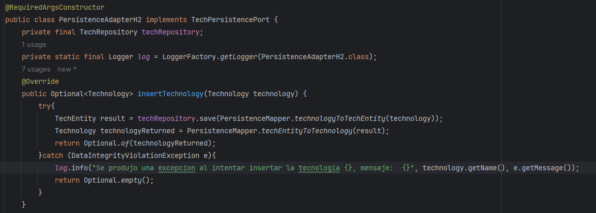

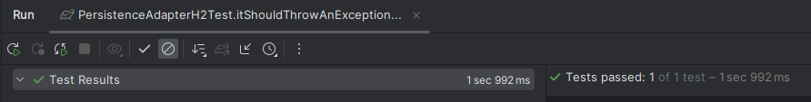 

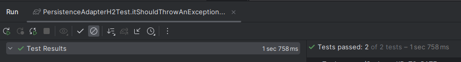 

## Terminamos la persistencia.

