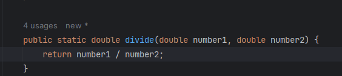
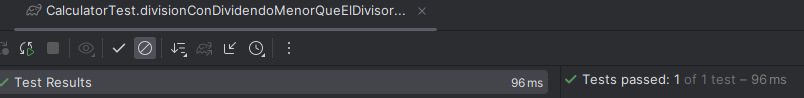

# ¡No solo pruebes el camino feliz!

En el testing, un antipatrón muy conocido es siempre testear el camino feliz y como la cobertura sea alta, puede que se encuentre
la tentación de dejar el programa así. Sin embargo, cuando comienza a correr en el ambiente, comienzan a salir errores que no esperabas
porque solo tomaste el camino feliz.

En esta sección, vamos a aprender a testear excepciones.

## Vamos a implementar la funcionalidad de división. 

1) Comenzamos por definir el comportamiento que debe tener la funcionalidad con BDD:

DADOS los números 10 y 5, CUANDO divida el 10 en 5 partes, ENTONCES el resultado debe ser 2. 
DADOS los números 10 y 12, CUANDO divida el 10 en 12 partes y redondee el resultado a 2 decimales, ENTONCES el resultado debe ser 0,83. 
DADOS los números 10 y -12, CUANDO divida el 10 en -12 partes y redondee el resultado a 2 decimales, ENTONCES el resultado debe ser -0,83.
DADOS los números 10 y 5, CUANDO divida el 10 en 0 partes, ENTONCES la función debe lanzar una excepción.

Para este ejemplo, cubrimos varios casos significativos que pueden presentarse y que el programa debe ser capaz de procesarlos de la forma esperada

2) Ahora escribimos el test como el caso de la calculadora, con el patrón GIVEN WHEN THEN:

   

3) Para el primer caso:

  

4) Creamos el método estático en la clase Calculadora:

Y ya se remueve el error del IDE porque existe el método:

Ejecutamos, y vemos que el test pasa correctamente:

Ejecutemos el siguiente test y veamos qué pasa:

  

El test no pasó por los decimales. Por lo tanto, debemos implementar el redondeo a 2 cifras decimales:

Refactorizada la función, corramos el test de nuevo:

Corremos el siguiente test y veamos qué pasa:

  

Corremos el siguiente test y veamos qué pasa:

 

Si corremos el test sabemos de antemano que va a lanzar una excepcion predeterminada. Pero queremos controlar la excepción. 
Por lo tanto, implementemos el código:

  

Ahora, hagamos que el test nos controle la excepción que lanzamos cuando eso pasa:

   

Corremos el test:

Ahora los corremos todos para saber si todo quedó bien:

